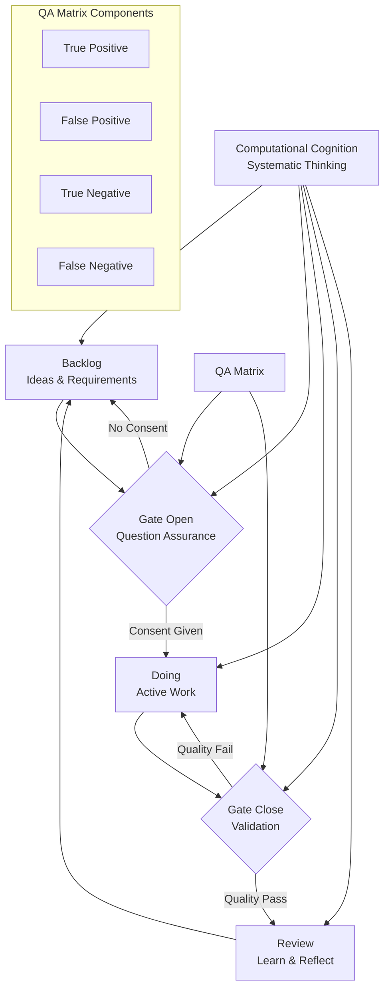

# GATING Philosophy: Computational Cognition for R&D

## Overview
GATING is a computational cognition framework that structures thinking and development through sequential decision gates. It transforms cognitive processes into measurable, gate-based workflows applicable to software development, research, and personal productivity.

## Core Concepts

### 🧠 Computational Cognition
**Definition**: The systematic ability to ask questions, solve problems, and make decisions through structured cognitive processes.

**Key Principles**:
- Thinking as computation
- Question-driven development
- Conscious decision gates
- Quality assurance at each cognitive step

### 🚪 The GATING Process
```
[Backlog] → [Gate Open] → [Doing] → [Gate Close] → [Review]
```

#### Phase Details:

1. **BACKLOG** - Idea Repository
   - Raw ideas, requirements, potential projects
   - Unstructured cognitive space
   - "What could be done?"

2. **GATE OPEN** - Decision Point
   - Explicit consent to begin
   - Question assurance validation
   - Resource commitment
   - "Do we proceed?"

3. **DOING** - Active Execution
   - Development/implementation phase
   - Continuous progress monitoring
   - "Active work in progress"

4. **GATE CLOSE** - Completion Check
   - Work completion verification
   - Quality validation
   - "Is this done correctly?"

5. **REVIEW** - Reflection & Learning
   - Process evaluation
   - Outcome assessment
   - Lessons learned
   - "What did we discover?"

## QA Matrix (Question Assurance)

```
          | Correct Question | Incorrect Question
----------|------------------|-------------------
Test Pass |   True Positive  |   False Positive
----------|------------------|-------------------
Test Fail |   False Negative |   True Negative
```

**Application**: Validates whether we're asking the right questions and getting correct answers at each gate.

## Implementation Example

### Software Development Gating:
```
BACKLOG: Migrate docs GitHub → GitLab
GATE OPEN: 
  - How to set up GitLab documentation?
  - How to ensure link integrity?
  - Security and inclusion checks?
DOING: Implementation work
GATE CLOSE: 
  - Documentation migrated ✓
  - Links functional ✓
  - Security validated ✓
REVIEW: Process evaluation and next steps
```

## Philosophical Foundation

### Your Personal Framework:
- **Neurodivergent Cognition**: Structured thinking for neurodiverse minds
- **Consent-Based Progression**: Explicit agreement at each stage
- **Quality-First Mindset**: Question assurance before action
- **Iterative Refinement**: Continuous improvement through gating

## Applications

### Research & Development:
- Hypothesis testing through gates
- Experimental validation cycles
- Knowledge discovery workflows

### Personal Productivity:
- Task management with conscious gates
- Decision-making frameworks
- Learning and skill development

### Software Engineering:
- Agile/Kanban/Waterfall integration
- Continuous integration gates
- Quality assurance pipelines

## Benefits

✅ **Clear Decision Points** - No ambiguous progress  
✅ **Quality Assurance** - Validation at every step  
✅ **Reduced Cognitive Load** - Structured thinking  
✅ **Explicit Consent** - Conscious commitment  
✅ **Measurable Progress** - Defined completion criteria  

## Mermaid Diagram: GATING Framework



## Getting Started

1. **Identify Your Project** - Place in backlog
2. **Formulate Key Questions** - Use QA matrix validation
3. **Open First Gate** - Give conscious consent to begin
4. **Execute with Awareness** - Work through doing phase
5. **Close Gates Systematically** - Validate completion
6. **Review and Iterate** - Learn and improve
